# 墨枢

<p align="center">
  
</p>

<p align="center"><strong>長編小説の執筆、整理、AI 支援を一つのローカルワークスペースへ。</strong></p>

<p align="center">日本語 | <a href="./README.zh-CN.md">简体中文</a></p>

墨枢（Moshu）は、日本語・簡体字中国語の長編小説に対応したローカルファーストのデスクトップ執筆環境です。本文、章構成、下書きメモ、人物関係、AI 会話、執筆タスク、要約キャッシュを一つの `.noveltool` プロジェクトで管理します。

バージョン `2.1.1` では、日本語 UI と日本語作品への対応、質問言語に合わせた AI 応答、Pi Agent ベースの自律的なツール実行、Agent 操作画面の再設計を行いました。

> 中国語の利用者向けマニュアルは [docs/USER_MANUAL.md](./docs/USER_MANUAL.md) を参照してください。

## 現在の画面

以下は `2.1.1` の実際の Electron アプリから取得した日本語 UI です。サンプル作品、人物関係、プロット、レビュー結果、執筆目標も実データ API で作成しています。

<table>
  <tr>
    <td width="50%"><strong>スタート画面</strong><br>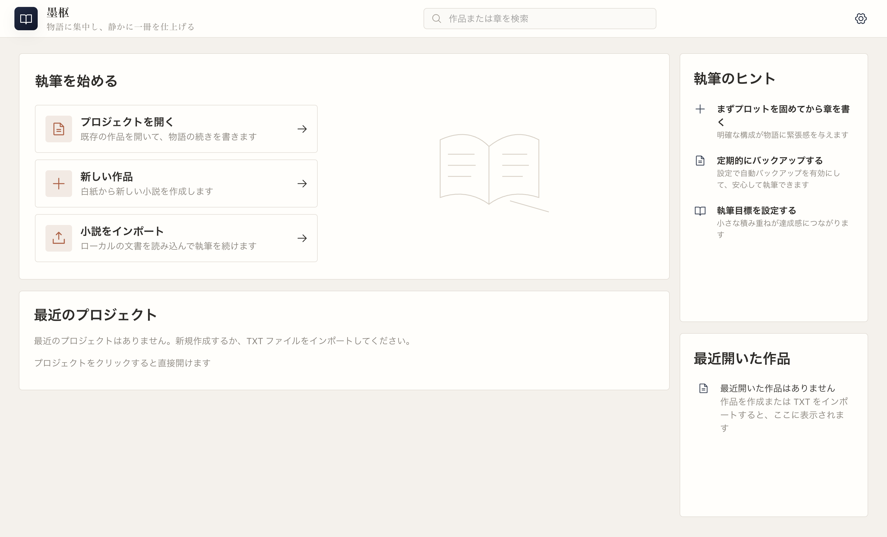</td>
    <td width="50%"><strong>執筆ワークスペース</strong><br>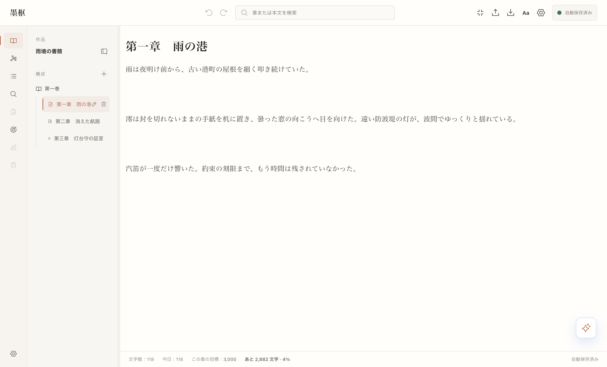</td>
  </tr>
  <tr>
    <td width="50%"><strong>Pi Agent のコンテキスト選択</strong><br>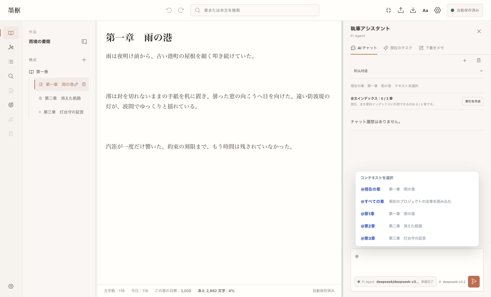</td>
    <td width="50%"><strong>Pi Agent の対話</strong><br>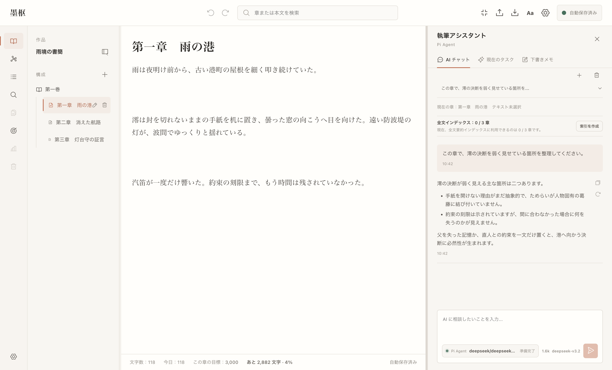</td>
  </tr>
  <tr>
    <td width="50%"><strong>作者設定の人物関係図</strong><br>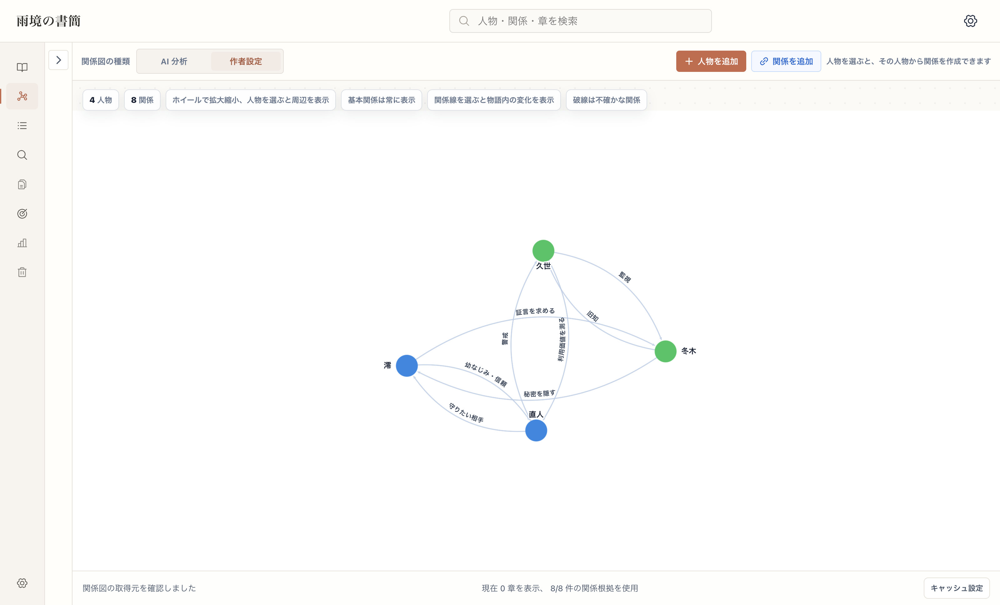</td>
    <td width="50%"><strong>作品全体のプロット</strong><br>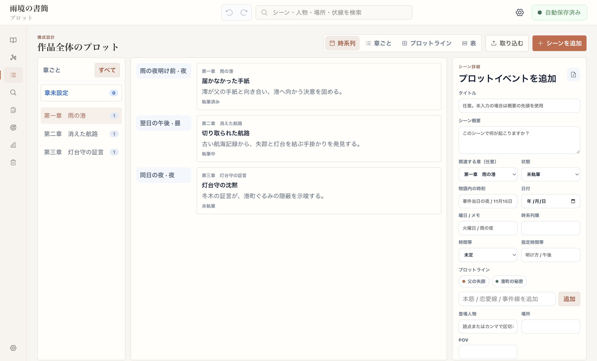</td>
  </tr>
  <tr>
    <td width="50%"><strong>章レビュー</strong><br>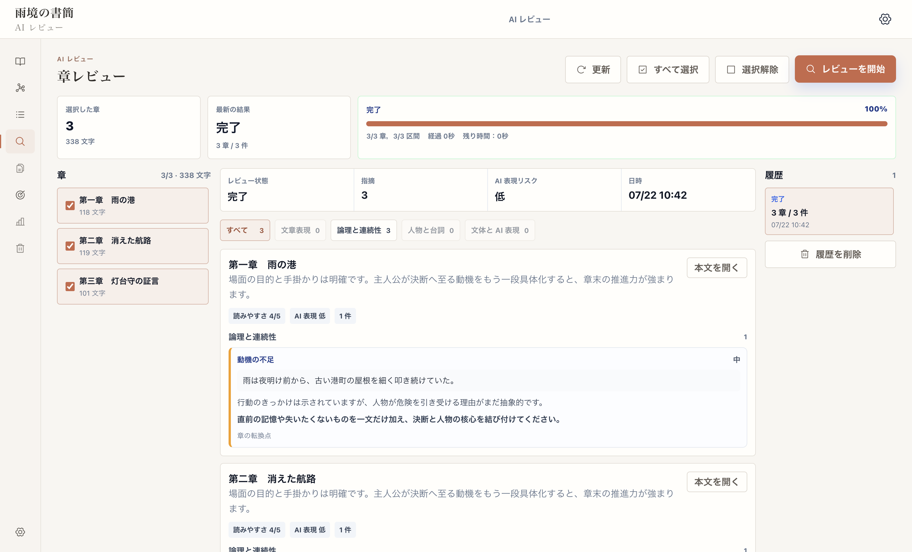</td>
    <td width="50%"><strong>執筆目標</strong><br>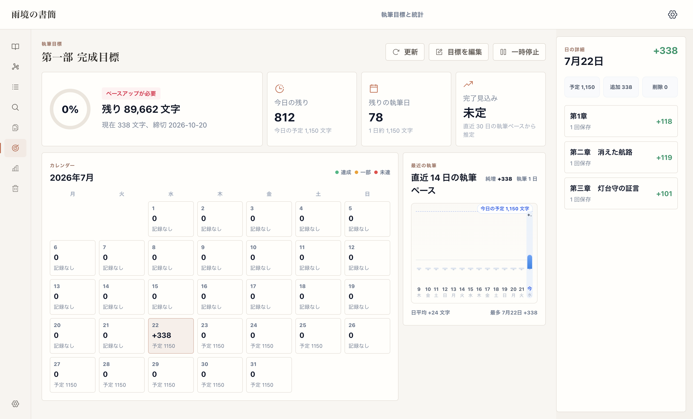</td>
  </tr>
  <tr>
    <td width="50%"><strong>AI サービス設定</strong><br>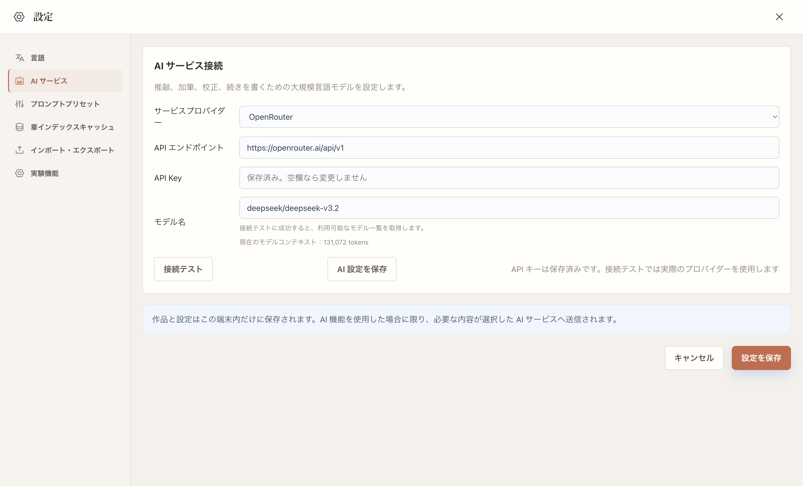</td>
    <td width="50%"></td>
  </tr>
</table>

## 設計方針

- **ローカルファースト**：作品データはローカルの `.noveltool` ファイルに保存します。
- **作者が最終決定者**：AI の推敲、加筆、校正、続きを書く操作は候補を作り、本文への反映は作者が確認します。
- **固定フローではない Agent**：Pi Agent が依頼ごとに必要な文脈とツールを判断します。
- **言語と作品を分離**：UI 言語、作品言語、今回の回答言語を別々に扱います。
- **拡張しやすい境界**：Agent ランタイム、作品用ツール、コンテキスト解決、UI 表示を分離しています。

## 主な機能

| 機能 | 内容 | 境界 |
| --- | --- | --- |
| 章エディター | 章の作成・検索・執筆・自動保存・目標文字数 | 画面移動や書き出し前に未保存内容を確認 |
| TXT 入出力 | 章見出しの検出、プレビュー、結合・分割、本文の書き出し | 既存本文を無断で上書きしない |
| 構成・下書きメモ | あらすじ、出来事、設定、候補文を本文と分けて管理 | TXT 書き出しには混在しない |
| 人物関係グラフ | 人物と関係を可視化し、章単位で確認 | 自動抽出結果と作者編集を区別 |
| 章レビュー・執筆目標 | 校正、章の確認、日次進捗を支援 | AI 結果はモデル品質に依存 |
| Pi Agent | 文脈取得、章の読解、整合性確認、執筆操作、メモ保存 | 必要なツールだけを自律的に選択 |
| 階層要約キャッシュ | 章・区間・全書の要約を長編コンテキストに利用 | キャッシュ失敗は本文保存を妨げない |

## Pi Agent

AI チャットは [`@earendil-works/pi-agent-core`](https://www.npmjs.com/package/@earendil-works/pi-agent-core) を基盤とし、OpenRouter の tools 対応モデルを利用します。画面に固定された手順を再生するのではなく、ユーザーの依頼を見て、追加の章を読む必要があるか、選択範囲を使うか、整合性を調べるか、執筆候補を作るかを Agent 自身が判断します。

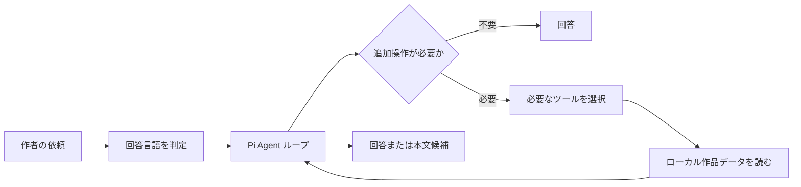

Agent が利用できる作品用ツールは次のとおりです。

| ツール | 用途 |
| --- | --- |
| `get_project_context` | 現在の作品、章、選択状態を確認 |
| `list_chapters` | 章一覧、順序、文字数を確認 |
| `read_chapters` | 現在の章、指定章、章範囲、全章の必要部分を読む |
| `read_selection` | エディターの選択範囲または貼り付け本文を読む |
| `check_continuity` | 時系列、人物状態、設定、因果、伏線の整合性を確認 |
| `run_writing_operation` | 推敲、加筆、校正、続きを書く候補を生成 |
| `add_to_scratchpad` | 作者が明示した場合だけ下書きメモへ保存 |
| `task_create` / `task_update` | 複数段階の依頼を画面上の進捗として整理 |

### 明示的な参照とスキル

通常の自然言語だけでも Agent は行動できます。参照範囲を固定したい場合は `@`、執筆操作を明示したい場合は `/` を使います。

```text
@現在の章 この章の緊張感が弱くなる箇所を指摘してください
@第4章 伏線と未回収の情報を整理してください
@すべての章 主人公の認識変化を章ごとに比較してください
@選択範囲 この台詞を自然にしてください

/推敲 語り口を保ったまま読みやすくしてください
/加筆 動作と心理のつながりを補ってください
/校正 誤字、文法、指示語の曖昧さを確認してください
/続きを書く 現在の場面から短く続きを作ってください
```

`@` や `/` を指定しても、不要な手順を固定実行するわけではありません。Agent は指定された範囲と目的を制約として受け取り、その中で必要なツールだけを呼び出します。

## 日本語・中国語対応

- UI は `日本語` と `简体中文` を切り替えられます。
- 新規作品と TXT インポート時に作品言語を指定できます。
- AI の回答言語は作品言語だけで決めず、今回の質問と明示的な言語指定を優先します。
- 日本語で質問した場合、Agent の回答、ツール表示、タスク進捗も日本語を使用します。
- 「中国語の本文を日本語で分析する」のように、本文言語と回答言語が異なる依頼にも対応します。

## 長編コンテキスト

現在の `2.1.1` は、必要な小範囲では原文を読み、広い範囲では章・区間・全書の階層要約キャッシュを併用します。章一覧は大規模作品で表示量を制限し、必要な章だけを改めて取得します。

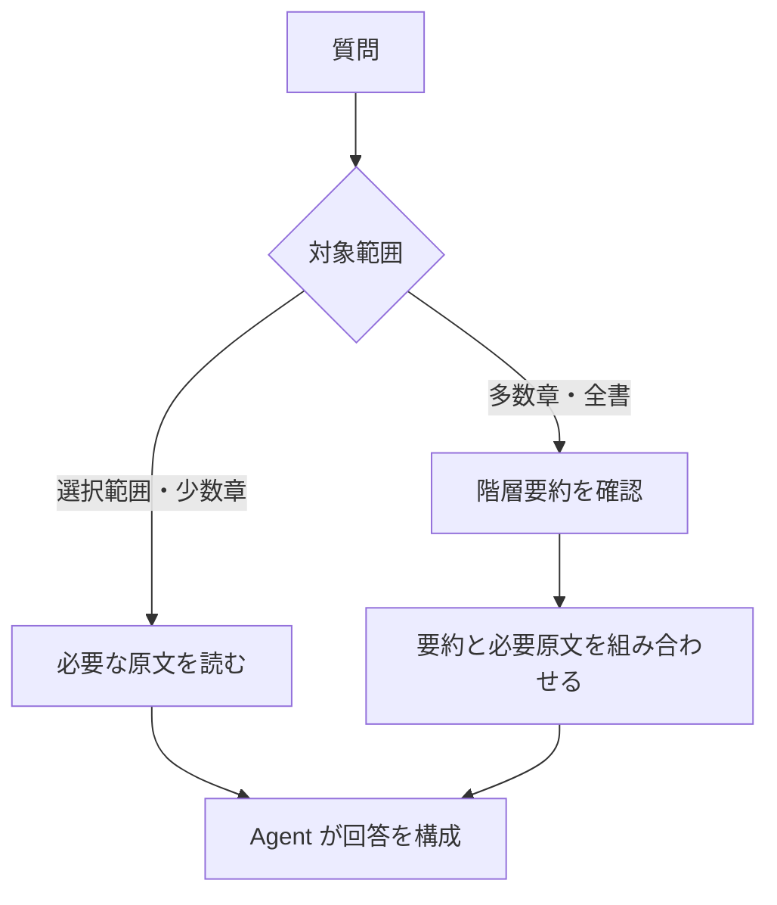

数千章規模では、全章要約の初回生成にも時間と API コストがかかります。バックグラウンド索引は停止できます。計画中の Novel Knowledge Workspace、RAG、増分知識グラフはこのバージョンにはまだ含まれていません。

## データと安全性

- `.noveltool` は SQLite ベースのローカルプロジェクトです。
- OpenRouter API Key はプロジェクトへ保存せず、アプリ側の安全な保存領域で暗号化します。
- 通常の執筆、保存、TXT 書き出しだけでは本文を外部へ送信しません。
- AI または要約機能を実行した場合だけ、必要なテキストを OpenRouter へ送信します。
- AI が生成した本文候補は、作者の確認なしに本文へ適用しません。

重要な作品では `.noveltool` ファイルの定期コピーと TXT 書き出しを併用してください。

## セットアップ

### 必要環境

- Node.js `>= 22.19.0`
- npm `10.9.2` 推奨
- Electron が動作する macOS / Windows 環境

依存関係は `package-lock.json` で固定されています。新規環境ではロックを変更しない `npm ci` を推奨します。

```bash
npm ci
npm run check:lockfile-safety
npm run dev
```

### ビルドと検証

```bash
npm run typecheck
npm test
npm run test:e2e
npm run build
```

`better-sqlite3` は、テスト時には Node ABI、Electron の起動・ビルド時には Electron ABI に合わせて自動的に再ビルドされます。

### OpenRouter

設定画面で次を設定してください。

- OpenRouter API Key
- tools 対応のモデル
- モデルのコンテキスト長

Agent は tools 非対応モデルを使用できません。モデル名と実行状態は Agent 入力欄のランタイムバーに表示されます。

## 開発構成

```text
src/main/ai/agent-runtime/  Pi Agent ランタイムと作品ポリシー
src/main/ai/                AI ツール、文脈、要約、執筆操作
src/main/db/                SQLite、マイグレーション、リポジトリ
src/preload/                Renderer に公開する安全な API
src/renderer/               React UI、エディター、Agent 画面
tests/unit/                 単体・回帰テスト
tests/integration/          DB・IPC・AI フローの統合テスト
tests/e2e/                  Electron E2E テスト
```

README 画像は [scripts/capture-readme-screenshots.mjs](./scripts/capture-readme-screenshots.mjs) で、隔離した実データと Electron の E2E AI スタブを使って再生成できます。CDP URL の後に `ja-JP` または `zh-CN` を指定すると言語別の画像フォルダーへ出力されます。スクリプトは主要操作、画面内のはみ出し、Renderer の console error / warning を検査します。

## 現在の制限

- クラウド同期と共同編集はありません。
- 章本文の完全な履歴管理はありません。
- 章の任意ドラッグ並べ替えには対応していません。
- TXT 書き出しには下書きメモ、AI 会話、要約キャッシュを含みません。
- AI の品質、速度、費用は選択した OpenRouter モデルに依存します。

## License

[LICENSE](./LICENSE) を参照してください。
