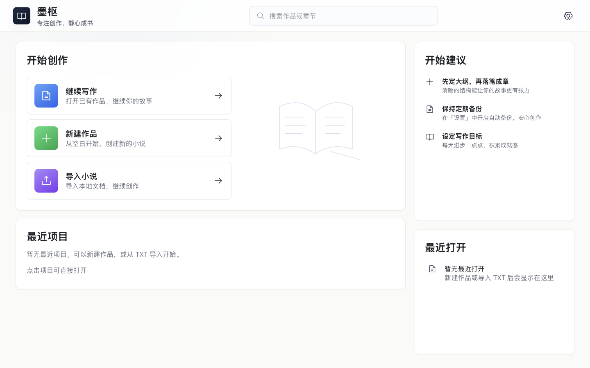
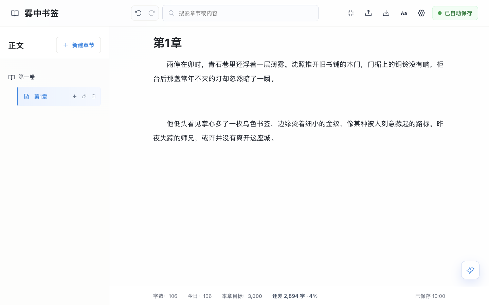
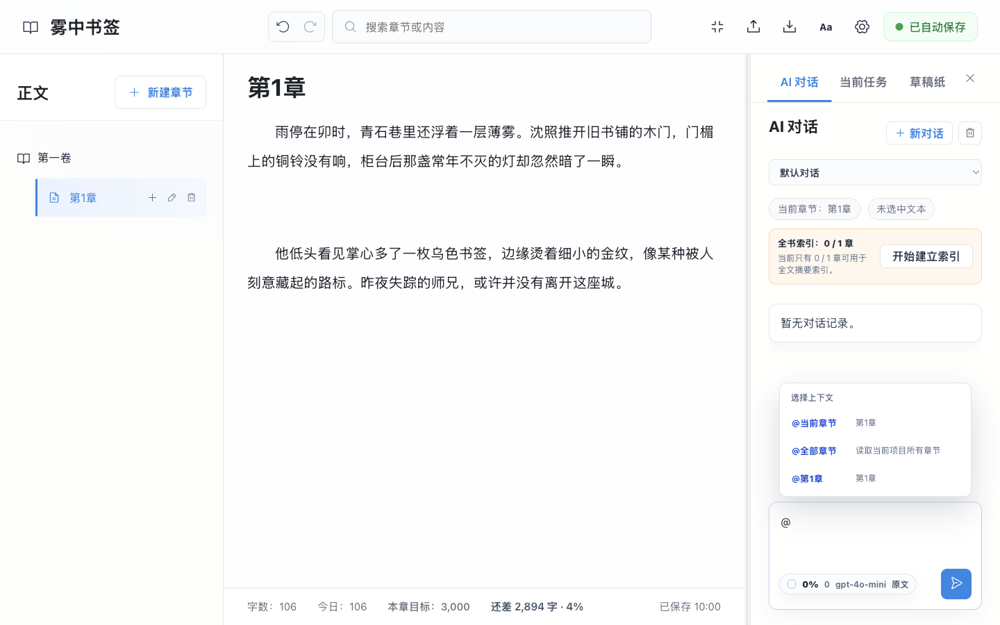
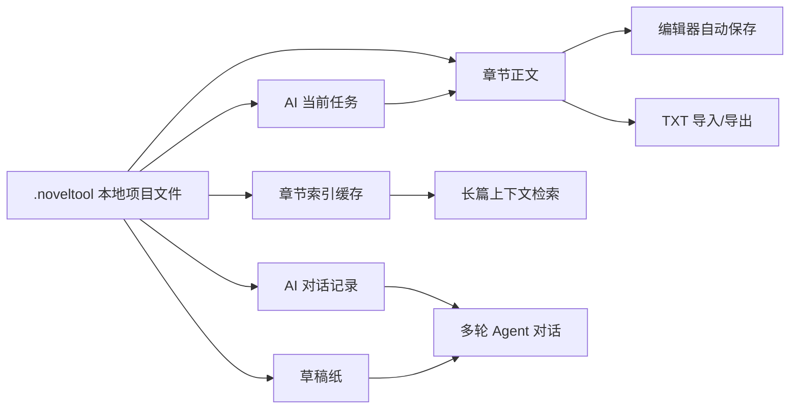
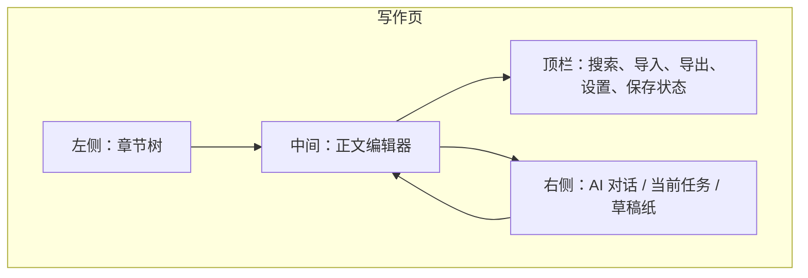
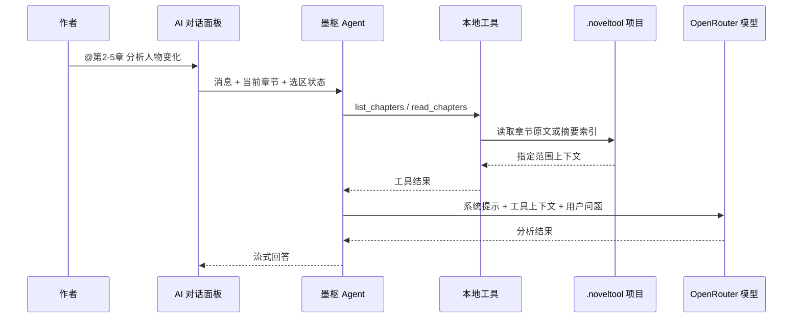
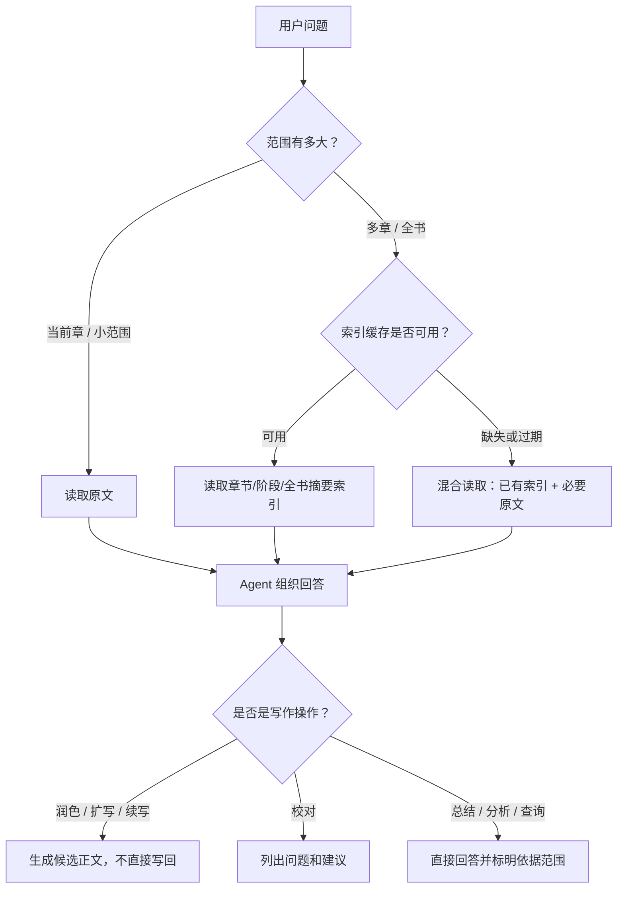
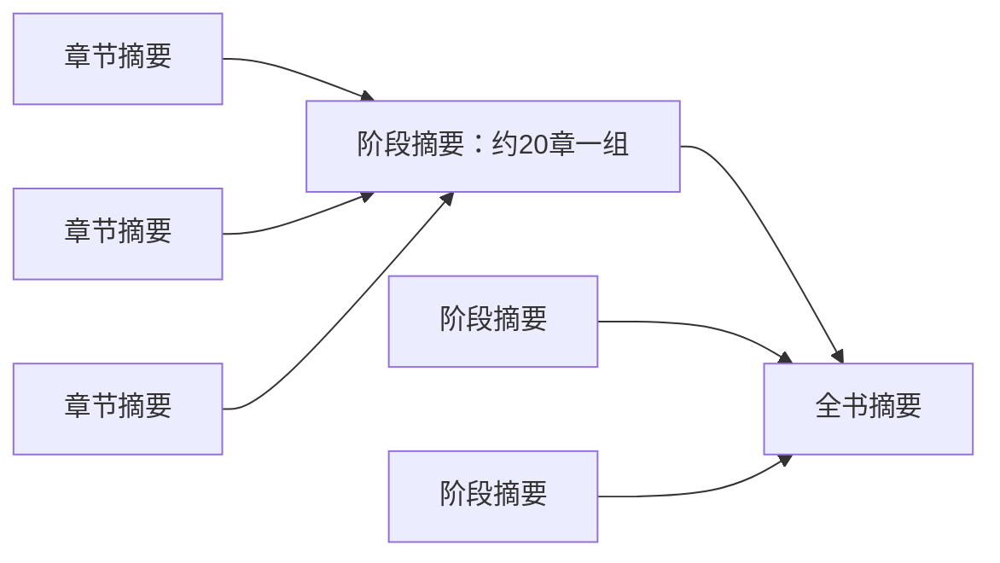
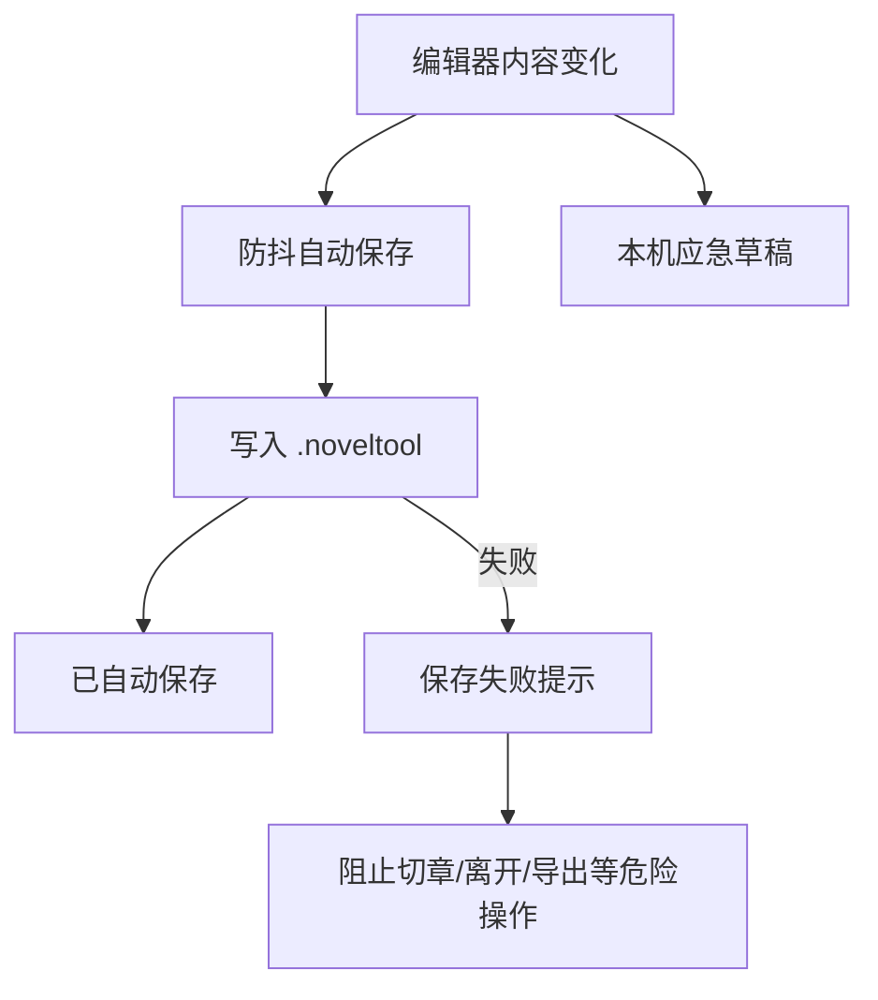

# 墨枢

<p align="center">
  
</p>

墨枢是一个面向中文长篇小说作者的本地项目型桌面写作工具。它把章节编辑、TXT 导入导出、草稿纸、AI 写作任务、AI 对话 Agent、章节索引缓存放在同一个 `.noveltool` 项目文件里，适合长篇连载、旧稿整理和多章节连续性检查。

> 作者使用说明见 [docs/USER_MANUAL.md](./docs/USER_MANUAL.md)。
> V1 开发与测试入口见 [docs/USER_GUIDE_V1.md](./docs/USER_GUIDE_V1.md)。

## 快速开始

### 环境

- Node.js 22+
- npm
- Electron 支持的桌面环境

### 安装依赖

```bash
npm install
```

### 启动开发版

```bash
npm run dev
```

### 打包

```bash
npm run build
```

### 常用检查

```bash
npm run typecheck
npm test
npm run test:e2e
```

`npm test` 会先重建 `better-sqlite3` 的 Node 原生模块。Electron 运行和打包前会通过 `electron-rebuild` 重建 Electron ABI 对应的原生模块。

## 实际界面

### 开始页



### 写作工作台



### Agent 上下文菜单



## 一眼看懂



墨枢不是云端写作平台，也不是简单的聊天壳。它的核心目标是让作者在本地维护一本作品，同时让 AI 能可靠地读取“指定章节、当前选区、全书摘要索引、草稿纸线索”，再给出可采纳的写作建议或候选正文。

## 核心能力

| 模块 | 能做什么 | 安全边界 |
| --- | --- | --- |
| 章节编辑器 | 管理章节、写正文、搜索章节和正文段落 | 切换页面和导出前会先尝试保存当前章节 |
| TXT 导入 | 识别章节标题、预览、重命名、合并、拆分后导入 | 追加导入只追加到当前项目末尾，不静默覆盖正文 |
| TXT 导出 | 导出全部章节正文 | 不导出草稿纸、AI 对话和索引缓存 |
| 草稿纸 | 保存灵感、设定、候选稿和 AI 整理结果 | 草稿纸不是正文，导出时不会混入正文 |
| AI 写作任务 | 润色、扩写、续写、校对 | 只生成候选结果，作者确认后才应用到正文 |
| AI 对话 Agent | 总结、分析、查伏笔、查人物状态、连续性检查、调用写作工具 | 不能伪造未读取章节，不能直接改正文 |
| 章节索引缓存 | 为长篇建立章节/阶段/全书摘要索引 | 缓存失败不影响正文保存，不会破坏项目文件 |

## 工作台布局



- 左侧用于管理章节。
- 中间是正文编辑区域。
- 右侧是辅助工作区，AI 对话、AI 任务和草稿纸都在这里。
- 顶栏保存状态非常重要：`编辑中`、`保存中`、`已自动保存`、`保存失败` 会明确告诉你当前正文是否已经落盘。

## Agent 重点说明

墨枢的 AI 对话不是把整本小说塞给模型然后等待回答。它是一个带工具的中文小说写作 Agent，会根据用户问题选择读取范围、读取模式和写作工具。

### Agent 工作流



### Agent 能使用的工具

| 工具 | 用途 | 典型问题 |
| --- | --- | --- |
| `get_project_context` | 获取项目状态、当前章节、是否有选区 | “我现在打开的是哪一章？” |
| `list_chapters` | 读取章节目录、顺序、字数 | “有哪些章节？” |
| `read_chapters` | 读取当前章、单章、章节范围、全书、选区上下文 | “前10章主线是什么？” |
| `read_selection` | 读取编辑器选区，或处理对话里粘贴的正文 | “把这段润色一下” |
| `run_writing_operation` | 调用润色、扩写、校对、续写任务 | “/扩写 第3章这一段” |
| `check_continuity` | 基于章节索引检查连续性风险 | “第5-10章有没有人物认知矛盾？” |
| `add_to_scratchpad` | 把整理好的内容写入草稿纸 | “把这份设定加入草稿纸” |

### @ 范围和 / 技能

你可以显式告诉 Agent 要看哪里：

```text
@当前章节 总结这一章的核心冲突
@第4章 查一下这一章的伏笔
@第2-5章 分析人物关系变化
@全部章节 梳理主线和未解决问题
@选区 润色一下这段
```

也可以用 `/` 明确调用写作技能：

```text
/润色 这段对白更自然一点
/扩写 增加动作、心理和场景压力
/校对 重点看错别字、病句和逻辑矛盾
/续写 顺着当前场景写一小段
```

不写 `@` 或 `/` 也可以，Agent 会根据自然语言判断。但长篇任务建议主动指定范围，例如 `@第1-10章`，比一句“总结全文”更稳定。

### 长篇上下文策略



章节索引缓存会按层级组织：



这让 Agent 可以在长篇项目里回答“人物状态变化”“伏笔列表”“时间线”“连续性风险”这类跨章节问题，而不必每次把全文都塞进模型窗口。

### Agent 的安全边界

墨枢对 Agent 的默认约束是“可读、可建议、可生成候选，但不能静默改正文”。

- 润色、扩写、续写只生成候选正文。
- 校对只生成问题列表和建议。
- 写回正文需要作者在当前任务或编辑器里确认。
- 只有作者明确说“加入草稿纸”时，Agent 才会调用草稿纸保存。
- Agent 读取不到的章节必须说明，不允许把当前章或相近章节当成目标章节。
- 如果使用的是摘要索引，回答应基于索引覆盖范围，不应声称已经逐字阅读全文。

## 保存与数据安全



- `.noveltool` 是本地 SQLite 项目文件，包含正文、章节、草稿纸、AI 对话、任务记录和摘要缓存。
- OpenRouter API Key 不写入 `.noveltool` 项目文件。
- 普通写作、保存和 TXT 导出不会自动发送正文。
- 只有主动使用 AI 功能或章节索引缓存时，相关文本才会发送给 OpenRouter。
- 建议定期复制 `.noveltool` 文件，或导出 TXT 作为纯文本备份。

## AI 配置

墨枢通过 OpenRouter 调用模型。进入应用设置页后配置：

- OpenRouter API Key。
- 聊天模型。
- 写作任务模型。
- 摘要缓存模型。

建议优先选择上下文窗口较大、JSON 输出稳定的模型。长篇全书总结、连续性检查、章节索引缓存都更依赖模型的上下文和结构化输出稳定性。

开发模式下可以查看发送给 OpenRouter 的完整 prompt：

```bash
NOVEL_TOOL_LOG_LLM_PROMPTS=1 npm run dev
```

日志只打印在开发终端，不会写入项目文件，也不会打印 OpenRouter API Key。

## 项目结构

```text
src/main/       Electron 主进程、SQLite、IPC、AI 服务
src/preload/    安全暴露给渲染层的 API
src/renderer/   React 写作界面、编辑器、侧栏和设置页
docs/           作者手册和开发说明
tests/unit/     单元测试
tests/integration/ 集成流程测试
tests/e2e/      Electron 端到端测试
```

重点文件：

- [src/main/ai/ai-task-service.ts](./src/main/ai/ai-task-service.ts)：AI 对话、上下文准备和任务编排。
- [src/main/ai/chat-agent-harness.ts](./src/main/ai/chat-agent-harness.ts)：Agent 循环、系统提示、工具调用和流式回答。
- [src/main/ai/chat-agent-tools.ts](./src/main/ai/chat-agent-tools.ts)：Agent 可用工具定义与执行。
- [src/main/ai/chat-agent-context.ts](./src/main/ai/chat-agent-context.ts)：章节范围解析、原文/摘要索引上下文组装。
- [src/main/ai/summary-service.ts](./src/main/ai/summary-service.ts)：章节索引缓存、阶段摘要和全书摘要。
- [src/renderer/sidebar/AiChatTab.tsx](./src/renderer/sidebar/AiChatTab.tsx)：右侧 AI 对话界面。
- [src/renderer/sidebar/CurrentTaskTab.tsx](./src/renderer/sidebar/CurrentTaskTab.tsx)：AI 候选结果确认与应用。

## 适合的使用方式

- 日常写作时只关注编辑器和保存状态。
- 处理某段文字时，先选中正文再用 `Ask AI` 或 `@选区`。
- 做长篇总结、人物线、伏笔线、连续性检查前，先在设置页建立章节索引缓存。
- 对全书级问题尽量指定范围和输出格式，例如 `@第1-20章 按人物列出状态变化`。
- AI 候选不满意时不要直接应用，可以复制、修改，或加入草稿纸作为备用材料。

## 当前边界

- 当前版本不提供云同步。
- 当前版本不提供章节历史版本。
- 当前版本不支持任意拖拽重排章节。
- 导出 TXT 只导出正文，不导出草稿纸、AI 对话或章节索引缓存。
- AI 输出质量依赖所选模型；章节索引缓存需要模型稳定返回结构化内容。

## License

见 [LICENSE](./LICENSE)。
