# 墨枢

<p align="center">
  
</p>

<p align="center"><strong>把长篇小说的创作、整理和 AI 协作放进一个本地工作空间。</strong></p>

<p align="center"><a href="./README.md">日本語</a> | 简体中文</p>

墨枢（Moshu）是一款面向日语、简体中文长篇小说的本地优先桌面写作工具。正文、章节结构、草稿纸、人物关系、AI 对话、写作任务和摘要缓存都保存在同一个 `.noveltool` 项目中。

`2.1.1` 版本加入了日语 UI 与日语作品支持、基于提问语言的 AI 回答、以 Pi Agent 为基础的自主工具调用，以及重新设计的 Agent 交互界面。

> 作者手册见 [docs/USER_MANUAL.md](./docs/USER_MANUAL.md)。

## 当前界面

以下截图来自 `2.1.1` 的真实 Electron 应用，界面语言为简体中文。示例作品、人物关系、大纲、审稿结果和写作目标均通过真实数据 API 创建。

<table>
  <tr>
    <td width="50%"><strong>开始页</strong><br>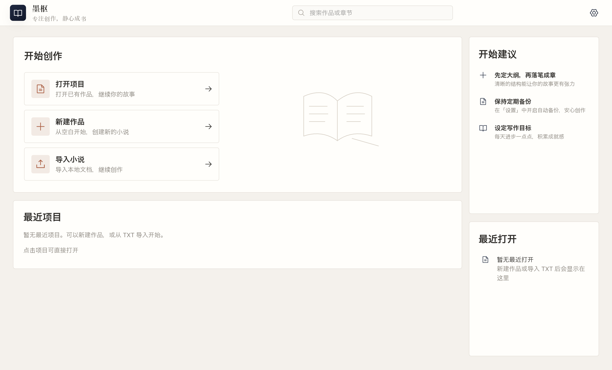</td>
    <td width="50%"><strong>写作工作台</strong><br>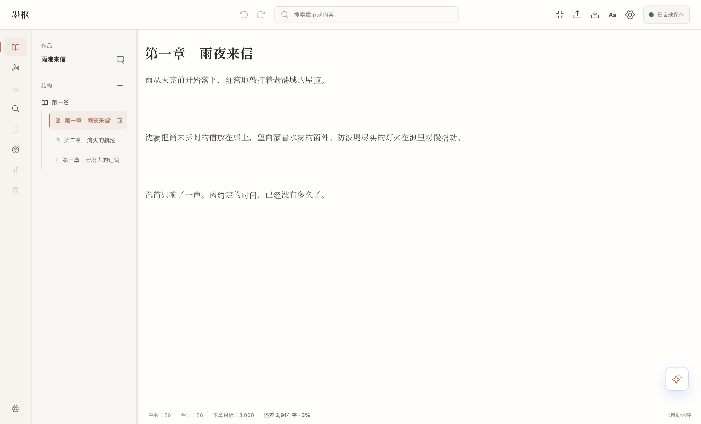</td>
  </tr>
  <tr>
    <td width="50%"><strong>Pi Agent 上下文选择</strong><br>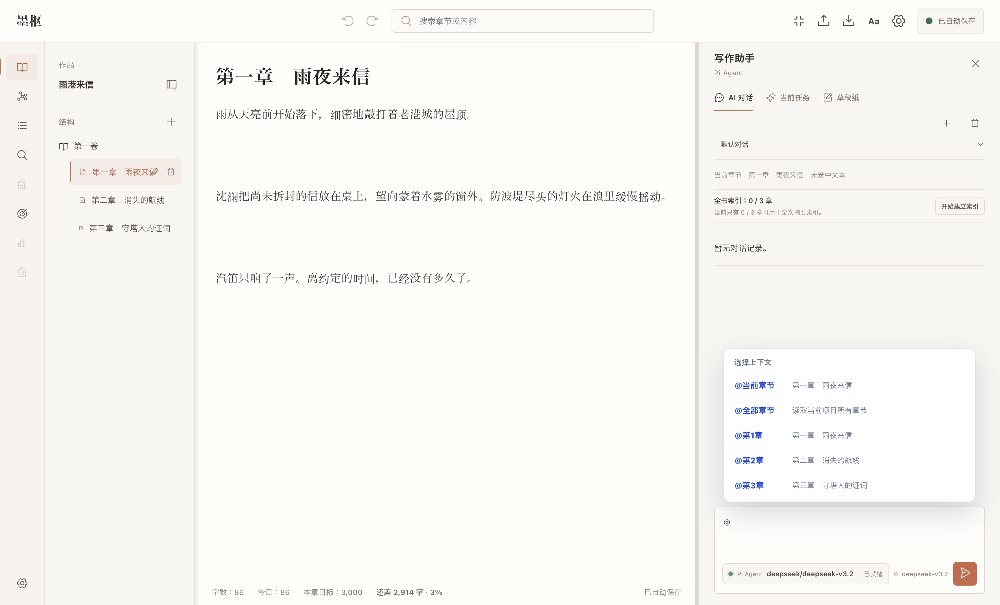</td>
    <td width="50%"><strong>Pi Agent 对话</strong><br>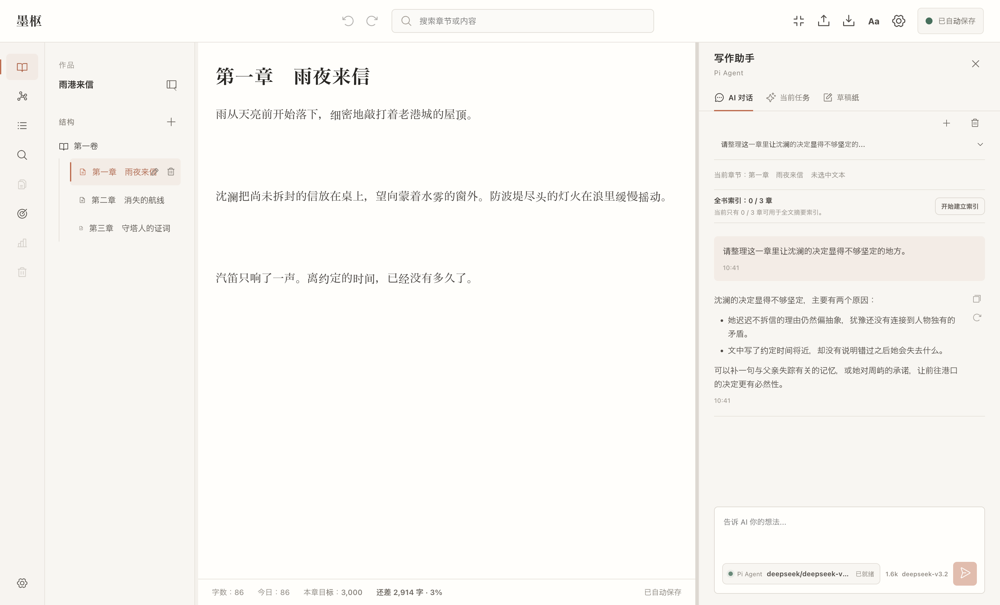</td>
  </tr>
  <tr>
    <td width="50%"><strong>作者设定人物关系图</strong><br>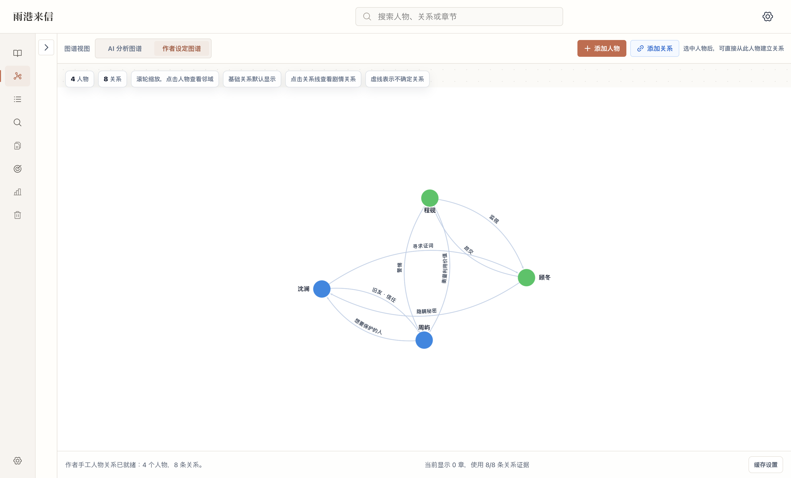</td>
    <td width="50%"><strong>全书大纲</strong><br>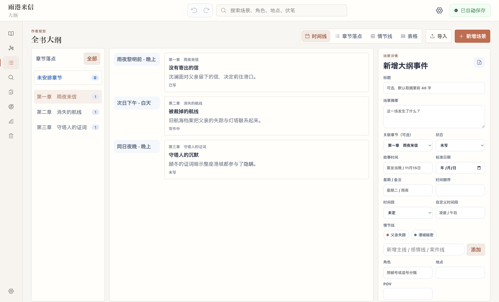</td>
  </tr>
  <tr>
    <td width="50%"><strong>章节审稿</strong><br>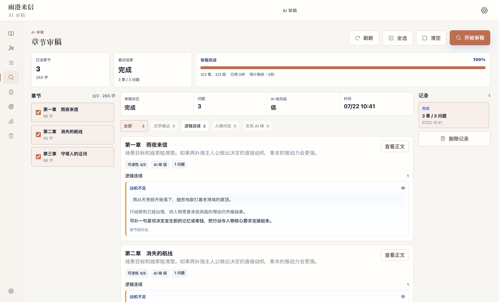</td>
    <td width="50%"><strong>写作目标</strong><br>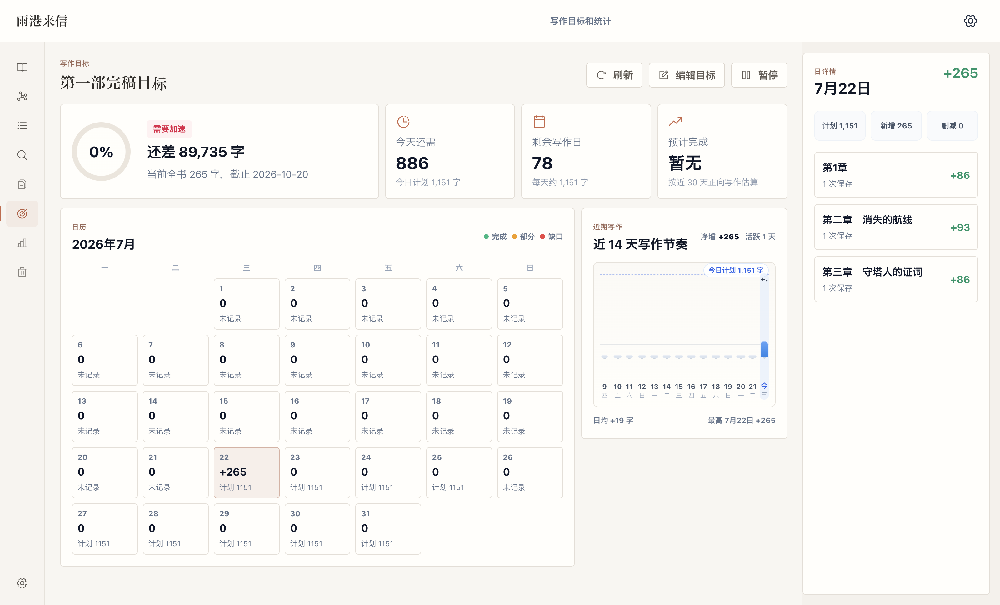</td>
  </tr>
  <tr>
    <td width="50%"><strong>AI 服务设置</strong><br>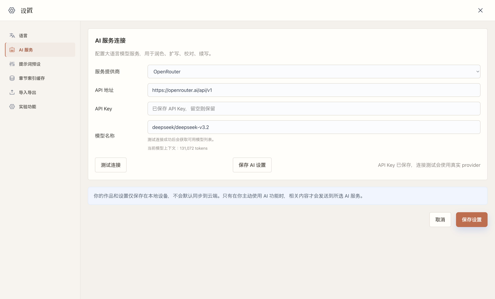</td>
    <td width="50%"></td>
  </tr>
</table>

## 设计原则

- **本地优先**：作品数据保存在本地 `.noveltool` 文件中。
- **作者最终确认**：润色、扩写、校对、续写只生成候选，应用正文前需要作者确认。
- **不是固定流程**：Pi Agent 根据每次 prompt 自主判断要读取的上下文和需要调用的工具。
- **语言彼此独立**：UI 语言、作品语言和本次回答语言分别处理。
- **低耦合扩展**：Agent 运行时、小说工具、上下文解析和 UI 展示保持分层。

## 核心能力

| 模块 | 能做什么 | 边界 |
| --- | --- | --- |
| 章节编辑器 | 新建、搜索和编辑章节，自动保存，设置章节目标 | 页面切换和导出前检查未保存内容 |
| TXT 导入导出 | 识别章节标题，预览、合并、拆分和导出正文 | 不静默覆盖已有正文 |
| 大纲与草稿纸 | 管理情节、事件、设定、灵感和候选稿 | 不会混入 TXT 正文导出 |
| 人物关系图 | 展示人物和关系，按章节观察变化 | 区分自动抽取和作者编辑 |
| 章节审稿与写作目标 | 校对章节、跟踪每日写作进度 | AI 结果依赖模型质量 |
| Pi Agent | 读取上下文、分析章节、检查连续性、执行写作操作 | 只调用当前请求需要的工具 |
| 分层摘要缓存 | 使用章节、阶段、全书摘要支持长篇上下文 | 缓存失败不影响正文保存 |

## Pi Agent

AI 对话以 [`@earendil-works/pi-agent-core`](https://www.npmjs.com/package/@earendil-works/pi-agent-core) 为运行基础，通过 OpenRouter 调用支持 tools 的模型。它不会重复一套预设流程，而是先判断现有上下文是否足够，再决定是否读取章节、读取选区、检查连续性、生成写作候选或整理任务进度。

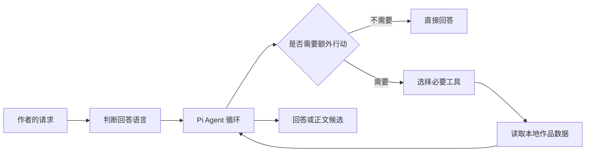

Agent 可使用的小说工具：

| 工具 | 用途 |
| --- | --- |
| `get_project_context` | 获取当前作品、章节和选区状态 |
| `list_chapters` | 获取章节目录、顺序和字数 |
| `read_chapters` | 读取当前章、指定章、章节范围或全书所需内容 |
| `read_selection` | 读取编辑器选区或用户粘贴的正文 |
| `check_continuity` | 检查时间线、人物状态、设定、因果与伏笔 |
| `run_writing_operation` | 生成润色、扩写、校对、续写候选 |
| `add_to_scratchpad` | 仅在作者明确要求时写入草稿纸 |
| `task_create` / `task_update` | 把多步骤请求整理为可见任务进度 |

### @ 引用与 / 写作技能

不写 `@` 或 `/` 时，Agent 也能根据自然语言自主行动。需要限制范围或明确写作操作时可以这样写：

```text
@当前章节 指出这一章削弱紧张感的段落
@第4章 整理这一章的伏笔和未解决信息
@全部章节 按章节比较主人公的认知变化
@选区 把这段对白改得自然一些

/润色 保留原来的叙述口吻
/扩写 补充动作、心理和场景压力
/校对 检查错字、语病和指代不明
/续写 顺着当前场景写一小段
```

`@` 和 `/` 是约束，不是固定执行脚本。Agent 仍然只调用当前请求真正需要的工具。

## 日语与中文

- UI 可在 `日本語` 和 `简体中文` 间切换。
- 新建项目和 TXT 导入时可指定作品语言。
- AI 回答语言优先依据本次提问和明确的语言要求，而不是只看作品语言。
- 使用日语提问时，回答、工具活动和任务进度使用日语。
- 支持“用日语分析中文正文”这类作品语言与回答语言不同的任务。

## 长篇上下文

当前 `2.1.1` 对小范围任务读取必要原文，对大范围任务组合章节、阶段和全书摘要。大型项目的章节目录会限制一次展示量，Agent 需要内容时再按明确章节读取。

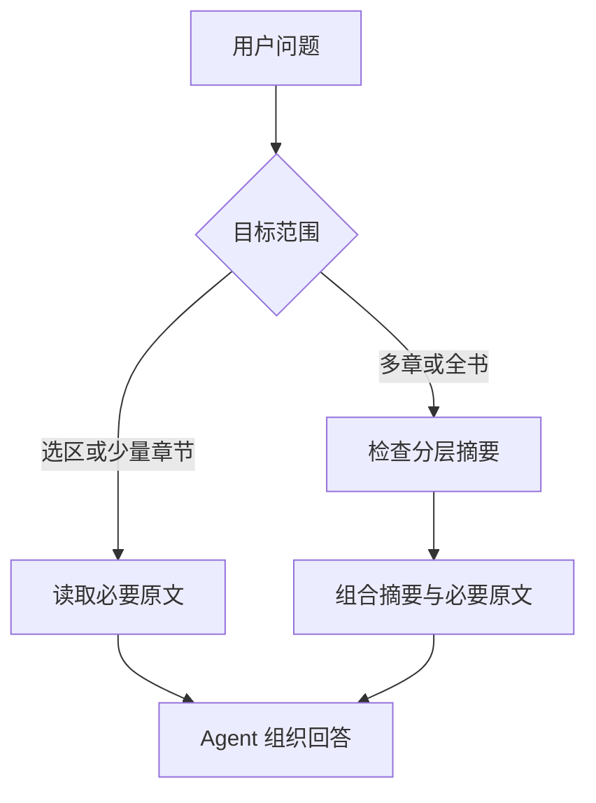

对于两三千章的项目，首次建立全章摘要仍会消耗明显的时间与 API 费用，后台索引可以停止。规划中的 Novel Knowledge Workspace、RAG 和增量知识图谱尚未包含在本版本中。

## 数据与安全

- `.noveltool` 是基于 SQLite 的本地项目文件。
- OpenRouter API Key 不写入项目文件，而是保存在应用侧的加密安全存储中。
- 普通写作、保存和 TXT 导出不会自动发送正文。
- 只有主动使用 AI 或摘要功能时，必要文本才会发送给 OpenRouter。
- AI 正文候选不会在未经作者确认的情况下写回正文。

重要作品建议同时备份 `.noveltool` 文件并定期导出 TXT。

## 快速开始

### 环境要求

- Node.js `>= 22.19.0`
- 推荐 npm `10.9.2`
- Electron 支持的 macOS / Windows 环境

依赖由 `package-lock.json` 锁定。新环境建议使用不会改写锁文件的 `npm ci`。

```bash
npm ci
npm run check:lockfile-safety
npm run dev
```

### 构建与验证

```bash
npm run typecheck
npm test
npm run test:e2e
npm run build
```

`better-sqlite3` 会在测试前重建为 Node ABI，在 Electron 启动和打包前重建为 Electron ABI。

### OpenRouter 配置

在设置页填写：

- OpenRouter API Key
- 支持 tools 的模型
- 模型上下文长度

Agent 不接受不支持 tools 的模型。当前模型和运行状态显示在 Agent 输入框底部的运行栏中。

## 项目结构

```text
src/main/ai/agent-runtime/  Pi Agent 运行时与小说策略
src/main/ai/                AI 工具、上下文、摘要和写作操作
src/main/db/                SQLite、迁移和数据仓库
src/preload/                安全暴露给 Renderer 的 API
src/renderer/               React UI、编辑器和 Agent 界面
tests/unit/                 单元与回归测试
tests/integration/          DB、IPC、AI 流程集成测试
tests/e2e/                  Electron 端到端测试
```

README 截图可通过 [scripts/capture-readme-screenshots.mjs](./scripts/capture-readme-screenshots.mjs) 在隔离项目和 Electron E2E AI 桩环境中重新生成。在 CDP 地址后传入 `ja-JP` 或 `zh-CN`，即可输出到对应语言目录。脚本会检查关键交互、视口裁切和 Renderer 的 console error / warning。

## 当前边界

- 不提供云同步和多人协作。
- 不提供完整的章节正文历史版本管理。
- 不支持任意拖拽重排章节。
- TXT 只导出正文，不包含草稿纸、AI 对话和摘要缓存。
- AI 的质量、速度和费用取决于所选 OpenRouter 模型。

## License

见 [LICENSE](./LICENSE)。
